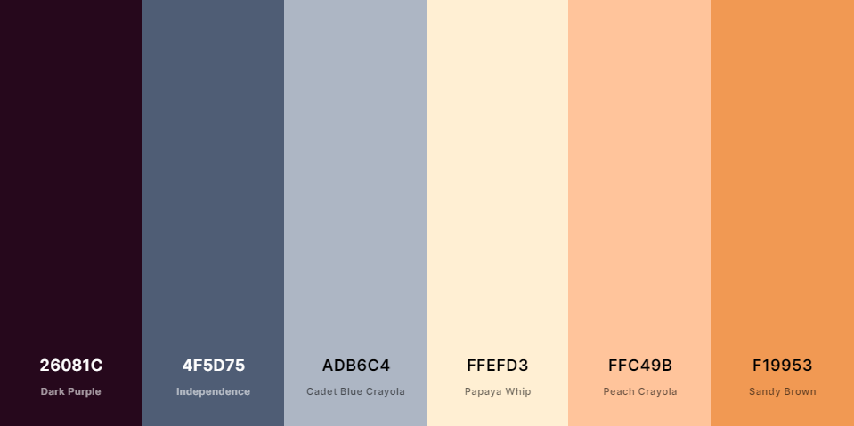

# Práctica 1

### 0. Estilo común a toda la web

Empecemos explicando detalles de estilo comunes a toda la web. Profundizaremos en algunos más adelante. El archivo de estilo común a toda la página se encuentra en `css/estilo.css`. No vamos a comentar todo el estilo de la página elemento a elemento, pero si las características más destacables que quizás no hemos explicado en clase o tienen mayor relevancia.

#### Tamaño para móbiles y tablets

Mi web tiene 3 posibles estados:

- Para pantallas de móbiles (anchura menor que `540px`).
- Para pantallas de tablets (anchura entre `540px` y `800px`).
- Para pantallas de ordenador (anchura mayor que `800px`).

Para ello añadimos al CSS lo siguiente:

```
@media (max-width: 800px) {
  .hide-tablet {
    display: none !important;
  }
}

@media (max-width: 540px) {
  .hide-mobile {
    display: none !important;
  }
}
```

Ahora utilizando las clases `hide-mobile` y `hide-tablet` podemos ocultar determinados elementos. Añadimos la palabra clave `!important` para sobrescribir cualquier otro tipo de `display` ya que si accedemos por identificador en vez de por clase, tendría prioridad, y este estilo no se aplicaría.

Aunque en nuestra práctica solamente aplicamos estilo distinto para móbiles y tablets a `index.html` es más correcto colocar aquí esta descripción para futura escalabilidad.

#### Márgenes

Para aprovechar el 100% de la pantalla con nuestra web y eliminar un margen extra añadido por defecto añadimos lo siguiente:

```
html {
  margin: 0px;
  padding: 0px;
  height: 100%;
  width: 100%;
}

body {
  margin: 0px;
  height: 100%;
  width: 100%;
}
```

#### Fuente

Para fijar la fuente basta con añadirla como parámetro al css. He seleccionado una de las fuentes gratuitas de Google, **Tritong**, y la he cargado añadiendo al `head` del HTML la línea:

```
<link rel="stylesheet"
  href="https://fonts.googleapis.com/css?family=Trirong">
```

Para utilizarla en todo el documento añadimos al estilo la siguiente línea:

```
body {
  font-family: "Trirong";
}
```

#### Paleta de color

Durante toda la práctica he utilizado una fuente de color fija:



https://coolors.co/26081c-4f5d75-adb6c4-ffefd3-ffc49b-f19953

La cabecera y el *footer* utilizando los colores azulados (***Independence*** y ***Cadet Blue Crayola***). La fuente de los mismos, así como el logo de *Netflix* utilizando el color morado (***Dark Purple***). Para obtener el logo en este color ha bastado con editarlo a mano.

Finalmente el cuerpo de la página utiliza los tres colores más cálidos de distintas formas: El fondo es siempre el más clarito, ***Papaya Whip***; objetos resaltados tienen fondo un poco más oscuro, ***Peach Crayola***; y, finalmente, cuando queremos resaltar mucho algún elemento utilizamos el último color, ***Sandy Brown***. Hablaremos en profundidad sobre este resalte más adelante.

#### Cabecera

Para diseñar la cabecera he utilizado *flexbox*. De esta forma el espacio se distribuye cómodamente. Adicionalmente, los botones de las distintas secciones se resaltan (cambian del color azul claro al azul oscuro) cuando pasamos el ratón por encima, y el puntero del ratón pasa a tener la forma de un dedo, listo para clickar.

Esto es un truco sencillo que usará cada vez que sea posible: añade interactividad a la página sin apenas trabajo extra. Para ello basta definir las siguientes reglas de estilo:

```
.blue-button {
  [...]

  background-color: #ADB6C4; <-- Azul clarito
}
.blue-button:hover {
  background-color: #4F5D75; <-- Azul oscuro
  cursor: pointer;
}
```

Con esto sobreescribimos el color del botón y cambiamos el cursor.

#### Footer fijado

Fijaremos el *footer* a la parte inferior izquierda de la pantalla para que su posición no varíe respecto a como subímos y bajamos en la página. Para ello añadimos lo siguiente:

 ```
 footer {
   position: fixed;
   left: 0;
   bottom: 0;

   width: 100%;
   [...]
}
 ```

#### Estilo de links

Los links por defecto adoptan distintos colores según se hayan utilizado o no. Esos colores no encajan con neustra paleta de color así que los quitaremos. Adicionalmente quitamos el subrayado por defecto:

```
a {text-decoration: none;}
a:link {color: black;}
a:visited {color: black;}
a:active {color: black;}
```

### 1. index.html

Este es el primer documento html de la práctica y uno de los más importantes. En él he puesto en práctica muchas de las técnicas que luego aplicaremos en el resto de documentos asi serán explicadas en profundidad en este apartado.

La página principal está dividida en:

```
<header class="header_and_footer">
  // Cabecera
</header>

<nav class="nav_section_button">
  // Barra de navegación con secciones
</nav>

<section id="main_page_container">
  // El bloque central de la página
</section>

<footer class="header_and_footer hide-mobile">
  // El footer
</footer>
```

La cabecera es una *flexbox*, como ya se comentó con anterioridad. La parte más interesante de esta página reside en la sección principal con `id="main_page_container"`. Este contenedor vuelve a ser una *flexbox* en dirección fila que engloba a tres elementos:

```
<section id="main_page_container">
  <aside class="hide-tablet" id="left_column_container">
    // Columna izquierda
  </aside>

  <aside class="hide-tablet" id="separator"></aside>

  <aside id="right_column_container">
    //Columna derecha
  </aside>
</section>
```

Como podemos ver tiene tres elemenos. Dos columnas principales a izquierda y derecha y un separador, la línea que divide ambas columnas. Las columnas tienen fijada una anchura del `40%` y `60%` respectivamente para que escalen automáticamente con la anchura de la página.

Adicionalmente, cada una de estas columnas es otra *flexbox*. La izquierda, para poder colocar centrada la imagen de Juego de Tronos. La derecha, para colocar los elemenos en formato columna y centrados respecto a su columna.

#### Contenedores extra y animación de zoom

Como se puede apreciar he creado unos cuadritos de color anaranjado (el color cálido intermedio) para las series y la imagen resaltada de Juego de Tronos. Esto le da más importancia y nos permite jugar con ciertas animaciones. Esto es, cuando ponemos el ratón sobre esto cuadritos, además de cambiar el color al más cálido, se agrandan ligeramente (como ocurre en la aplicación original de Netflix).

Crear esta mini animación es muy sencillo. Por ejemplo, para la imagen resaltada de Juego de Tronos, creamos el siguiente contenedor para darle color al fondo:

```
<aside id="featured_image_container">
  
</aside>
```

Con el siguiente CSS:

```
#featured_image_container {
  [...]

  padding: 10px;
  background-color: #FFC49B; <--- Naraja
  transition: 0.2s;
}
#featured_image_container:hover {
  background-color: #F19953; <--- Naraja cálido
  transform: scale(1.02);
  cursor: pointer;
}
```

Utilizando `padding` creamos un pequeño borde artificial alrededor de la imagen que coloreamos de naraja. Añadimos `transition: 0.2s;` para especificar que hay una animación y que esta dura `0.2s`. Por último, en `:hover`, añadimos `transform: scale(1.02);` para que la imagen aumente un `2%` su tamaño. Aunque puede parecer poco, el resultado es el deseado: el efecto es perceptible pero no molesto, y vuelve la página más interactiva.

#### Barra de scroll

Para añadir un listado de series con un scroll que no haga mover toda la página creamos un contenedor dentro de la columna derecha en el que colocaremos todos los bloques de series con id `featured_list_container`. Le añadimos el siguiente estilo:

```
#featured_list_container {
  height: calc(100vh - 200px);
  overflow-y: auto;
}
```

Por un lado, fijamos la dirección del scroll `  overflow-y: auto;` para que sea vertical y aparezca sólo cuando el contenido no cabe en la ventana.

Por otro lado, `height: calc(100vh - 200px);` fija la altura del contedor a 100% de la altura del *viewport* (esto es, el tamaño de la ventana) menos `200px`. Para hacer esta cuenta utilizamos la función `calc()`.

Esta altura está "hardcodeada" porque la altura de la página es fija respecto al tamaño del header y el footer. Como sus alturas no varían al cambiar el tamaño de la ventana, la diferencia de `200px` es fija al variar el tamaño de la ventana.

Si utilizasemos un porcenaje como `height: 80%;` tendríamos errores, veámos por qué:

- Supongamos que la ventana tiene altura `1000px` originalmente, entonces el `featured_list_container` tendría `1000px * 0.8 = 800px`, que al sumarle los `200px` de *header* y *footer* componen la ventana entera. Todo bien.

- Supongamos que reducimos la ventana a la mitad, `500px`. Reducimos así la altura de `featured_list_container` a la mitad, `400px` pero el *header* y *footer* tienen altura fija `200px`, y nos nuestra página tendría una altura mayor que la ventana. Esto provoca que se cree una barra de scroll adicional para toda la ventana que es justo lo que queremos evitar.

Es por ello que definirlo utilizando la función `calc()` proporciona buenos resultados.

#### Modo móvil y modo tableta

Finalmente merece la pena destacar las variaciones aplicadas para que la página sea lo más utilizable posible para móviles y tabletas. Para ello, además de hacer la anchura y altura de los elementos variar correctamente con el tamaño de la ventana, así como el tamaño de letra de lo nombres de las series utilizando `font-size: 2vw;`; hemos definido los modos móvil y tableta.

Para más información sobre cada modo consultar la sección **Tamaño para móbiles y tablets**.

En esta página, el modo tableta provoca que se elimine una de las secciones (Sección 4) de la barra de navegación. Adicionalmente eliminamos la columna izquierda con la imagen de Juego de Tronos y el separador. Para ello basta con añadir a estos elementos la clase `hide-tablet`. Sin embargo, esto provoca que la anchura de la columna derecha (fijada al `60%`) no cubra toda la anchura. Es por ello que hemos de añadir el siguiente código a nuestro estilo:

```
@media (max-width: 800px) {
  #right_column_container {
    width: 100% !important;
  }
}
```
Para el modo móvil eliminamos una sección adicional de la barra de direcciones (Sección 3). Con mayor tiempo crearía una barra que se desplazase lateralmente para la navegación en móvil, pero tener demasiadas secciones rompe el resto de la página.

Puesto que la cabecera sigue ocupando demasiado espacio la ponemos en formato columna. Para ello basta moficiar la dirección de nuestra *flexbox*:

```
@media (max-width: 540px) {
  header {
    flex-direction: column;
  }
}
```

### 2. sitioweb.html

Esta página es prácticamente igual que la anterior. Merece la pena remarcar que nuestro logo tiene un link a la página principal tras habernos loggeado en todas las páginas, excepto en la página inicial `index.html`, donde es un link a si misma.

### 3. Secciones (seccionk.html)

Para el contenido principal de esta página utilizamos una *flexbox* en horizontal para establecer tres columnas, `main_page_container`. Dentro de dicha caja colocamos tres `aside`s, `column_container`. Estas serán flexbox en dirección columna. De esta forma lo que conseguimos es que las tres columnas tengan siempre anchura fija, `32%` de la anchura de la página, mientras que los elementos en cada columna pueden variar de altura sin afectar a la verticalidad. Dentro de cada columna colocamos tres elemenos `movie_box` que contienen la imagen y el texto de cada película.

A si mismo, cada `movie_box` es una *flexbox* con dos componentes: la imagen, y un contenedor para el texto. El contenedor para el texto vuelve a ser una *flexbox* columna. De esta forma podemos centrar el texto dentro de su columna sin afectar a la imagen y, al mismo tiempo, no desperdiciar espacio.

Hay un par de detalles adicionales que merece la pena mencionar. La barra de navegación inferior vuelve a ser una *flexbox* para centrar y espaciar correctamente los elementos. Las opciones de adelante y atrás son circulares. Así mismo, el número de la página dentre de la sección en la que estamos se marca en negrita utilizando la clase `bold`.

Finalmente, hemos utilizado *SVG*s para las flechas de izquierda y derecha en vez de imágenes. Para los símbolos de una página web suele ser aconsejable utilizar este tipo de elementos. Están definidos geométricamente en vez de pixel a pixel. Esto provoca que apenas consuman memoria y que su resolución no se reduzca al ampliarlos.

Cabe destarcar que se ha utilizado la clase `ghost` con `opactiy: 0.0;` para hacer que un objeto sea invisible pero siga ocupando espacio en la pantalla (diferencia fundamental respecto a `display: none;`). Esto hace que si estamos en la página 1 de la sección, la flecha izquierda no se muestre. Aún así, ocupa espacio, y al pasar a la página siguiente los números estarán centrados en el mismo sitio y ahora si aparecerá la flecha.

### 4. item.html

Esta página es bastante sencilla en comparación con las anteriores. Se utilizan de nuevo *flexboxs* para colocar el contenido donde queremos.

Unicamente se han diseñado tres items:

- Las Chicas del Cable
- Friends
- Como conocí a vuestra madre

Cualquier objeto de la página que se clicke y no sea uno de estos tres te redirigirá a Las Chicas del Cable (`item1.html`). Además, al pulsar **Siguiente** repetidamente iteraremos sobre estos tres elementos. Finalmente, todos los links a estos objetos son a partir de la cajita naranja que rodea a cada elemento al completo, no solamente respecto al título o la imagen.

### 5. administracion.html

Esta página es muy sencilla, se ha definido el concepto de `orange-button` en `estilo.css` para poder utilizarlo también en los siguientes formularios. Adicionalmente, esta páguna tiene un poquitín de estilo para colocar los botones en su sitio y por ello he creado un nuevo archivo `administracion.css`.

### 6. contacto.html

Muy parecido al anterior. Se ha creado un nuevo archivo *CSS* con apenas unas líneas de código. Personalmente creo que estos archivos con muy poco estilo que además no es particularmente generalizable deberían de ser incluidos en cada archivo utilizando `<style>`. No lo he hecho porque las directrices de la práctica van en contra de esta práctica de forma explícita.

Sobre el contenido, debido a que subiré esta práctica a GitHub no he peusto información personal en este archivo.

### 7. altaitem.html

En esta página hemos creado un formulario para añadir nuevas series. He añadido campos de forma variada para probar con distintos tipos de inputs en un formulario. En cuando al estilo, por un lado el botón de `submit` lo hemos retocado para que se asemeje al resto de botones. Para ello utilizamos la clase `orange-button` ya definida y creamos una nueva, `submit_button`:

```
.submit_button {
  margin-top: 2px;
  margin-bottom: 5px;
  vertical-align: center;
  cursor: pointer;
  margin: 0px;
  padding: 0px 20px;
  border: none;
}
```

Importante añadirla después que la clase `orange-button` en el archivo `estilo.css` para sobreescribir aquellos valores duplicados. Aprovechamos para dotar del mismo estilo al botón del formulario de `index.html`, esta vez combinando `blue-button` con `submit_button`.

Para la subida de la imagen, este es un elemento cuyo estilo es muy complicado de manipular. Una forma sencilla es esconder por completo el elemento y usar su etiqueta asociada:

```
HTML:

<label class="orange-button file_selector">
  <input id="image" type="file" required/>
  Seleccionar imagen
</label>

CSS:

input[id="image_logo"] {
    display: none;
}
```

Así dotamos a la etiqueta del estilo de un botón naranja y ocultamos el input. Sin embargo, perdemos la posibilidad de enseñar el archivo seleccionado. Esto se arregla con un poco de JS, pero aún no podemos hacerlo. Para este tipo de estilo me he ayudado de la siguiente referencia:

https://stackoverflow.com/a/25825731/10128619

Sabemos que se está seleccionando una imagen porque al poner el archivo como `required` no podemos enviar el formulario sin haberla seleccionado. La selección de archivo de `altausuario.html` tendrá un diseño distinto para poder ver el archivo seleccionado.

### 8. altausuario.html

Para la alta de usuario hacemos un formulario parecido al de alta de items utilizando nuevos tipos no vistos en el anterior: contraseña, email, teléfono, un rango y una URL.

Como ya se comentó, para seleccionar archivo no se ha modificado el estilo en este formulario para poder comparar al anterior que sí estaba estilizado.

Para introducir la URL hay que tener en cuenta que su verificación sigue el siguiente esquema: `urlscheme://restofurl`. Ejemplo: `https://ugr.es`. Fuente: https://developer.mozilla.org/en-US/docs/Web/HTML/Element/input/url#value

Adicionalmente, se ha añadido un link desde la página `index.html` para que si no estás loggeado puedas crear un nuevo usuario.
